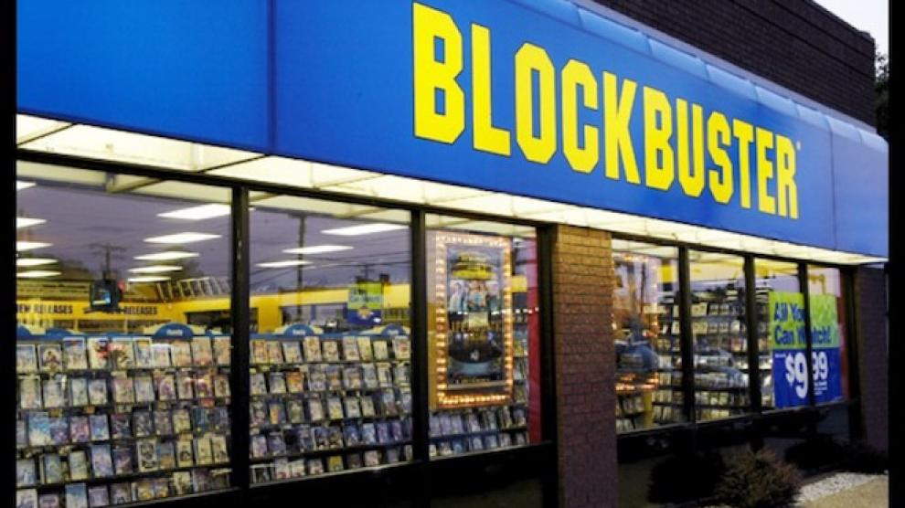
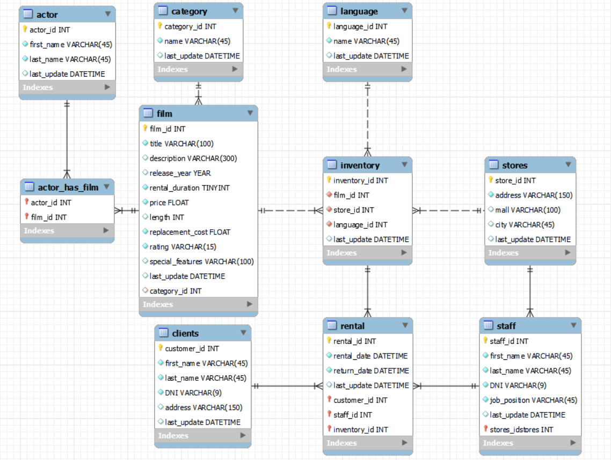

# Ironflix-Database

# Objetivo principal

En el siguiente proyecto sobre pandas y SQL realizado en IronHack nos encargaremos de, a través de unos CSVs con datos sobre un antiguo videoclub, crear, estructurar y rellenar una base de datos en SQL con el fin de "reabrir" dicho videoclub.

# Proceso del proyecto a nivel general

El proceso se divide en los siguientes pasos:

- Análisis exhaustivo en pandas de los CSVs con el fin de ver de que datos disponemos y poder estructurar más adecuadamente la base de datos de cara al negocio propuesto.
- Creación de dicha estructura en MySQL a través de un modelo entidad relación.
- Reestructuración de los datos y limpieza de los mismos con Pandas preparándolos para la futura inserción en la base de datos. 
- Inserción de los datos en la base de datos.
- Realización de querys de prueba y de posible interés.

# Explicación del proceso y toma de decisiones

Para empezar en base a la observación de los datos estructuro un modelo entidad relación de la siguiente manera:

EXPLICACIÓN DEL MODELO ENTIDAD RELACIÓN

Explicado de izquierda a derecha se entiende que:
    
* Establezco una relación many to many entre la tabla actor y la tabla film que pasa por la tabla actor_has_film.
* La tabla film está a su vez relacionada con la tabla category en una relación one to many donde una categoría puede estar en múltiples películas.
* Por último esta tabla (film) se relaciona en una relación one to many con la tabla inventory donde una película puede existir múltiples veces en el inventario (podemos tener varias copias de una misma película).
* A su vez inventory también tiene una relación one to many con la tabla language pues el mismo idioma puede aparecer múltiples veces en inventario. No lo relacioné con film como si se hacía en los datos originales para que en dicha tabla no exista ningún título repetido. 
* También con stores, ya que será la relación que defina de que tienda es dicho inventario. Inicialmente solo disponemos de una tienda pero decidí crear esta tabla por si el negocio crece.
* Lo mismo pasa con staff, tabla que está relacionada también con stores en una relación one to many (en una tienda habrá múltiples miembros del staff), inicialmente disponiendo de un único dato, yo mismo.
* Staff e inventory están ambas relacionadas con rental, al igual que clients. Todas en una relacion one to many de forma que rellenen esta tabla con los datos de que cliente alquila, que staff le atiende y que producto se está alquilando (además de otros datos de interés).
* Clients y rental también estarán vacias ya que no me interesa saber que clientes tuve hace x años ni tampoco que se alquiló entonces.
* Antes de continuar con la estructuración y la limpieza de los datos decir que se puede llegar a la conclusión por lo ya expuesto que las tablas a llenar con los datos de los CSVs son Actor,Actor_has_film, Film, Category, Inventory y Language.
 

LIMPIEZA DE LOS DATOS

En cuanto a la estructuración y limpieza de los datos, se utiliza el dataframe proveniente del CSV old_hdd a modo de nexo entre actor y film y de film y category. Se sacará de este tanto la FK de category_id que introduciremos en la tabla de film para relacionarla con category como, a través de los nombres y apellidos de los actores y el título de las pelícuas, las FK de actor y film. Esto, eliminando las columnas usadas y dejando las nuevas que representan los ids, nos deja una tabla preparada para ser introducida en actor_has_film.

Por otro lado, de la tabla film sacamos la FK de language para introducirla en la tabla de inventory. También en inventory igualaremos a 1 todos los valores del FK de store pues de momento solo contamos con una tienda. 

Una vez hecho esto y comprobado que todos los datos son correctos y no hay nulos donde no debería haberlos[^*], podemos proceder a la inserción de los datos. Las tablas no mencionadas solo sirvieron como aporte de información ya sea al análisis de los datos para la futura creación de la base de datos como para la inserción misma de estos en la base.

Finalmente una vez introducidos correctamente los datos realizamos una serie de querys que simulan nuestro primer servicio asi como la búsqueda de algunos datos de interés

[^*] Existen nulos para la FK de category en film pues no tenemos todos los datos de a que categoría pertenece cada película y como no depende de nosotros se ha dejado así. Del mismo modo no sabemos según que actores en que películas participan. Por último da la sensación de que no tenemos los datos reales del inventario del que disponemos, al menos por lo que parece ver en los antiguos datos de rental.

# Conclusiones

El resultado final del proyecto es una base de datos con una estructura adecuada al modelo de negocio esperado y con el mejor aprovechamiento de los datos otorgados, aunque siendo conscientes de su incompletitud.
